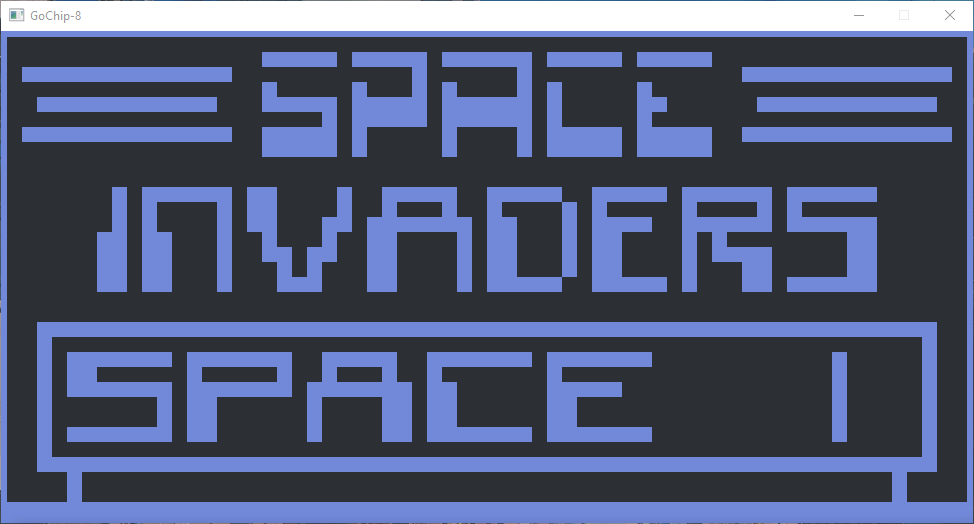
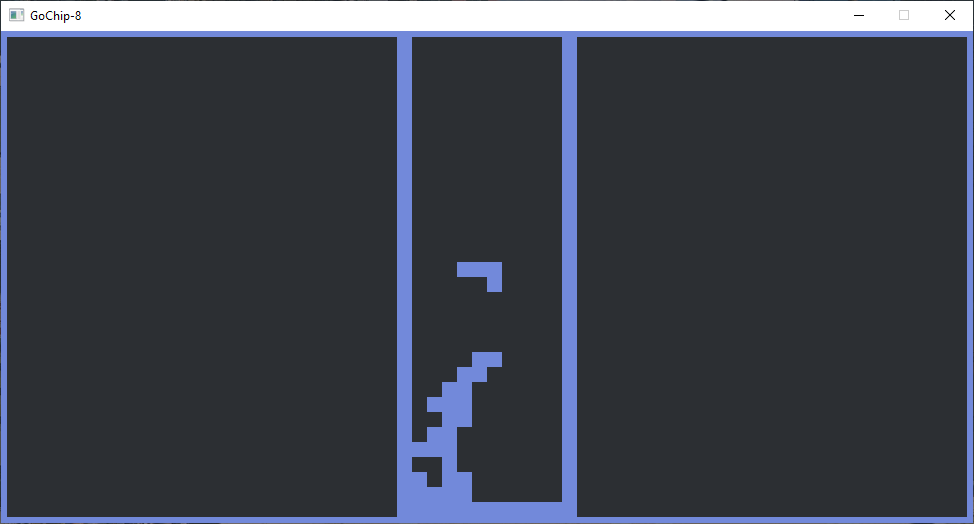
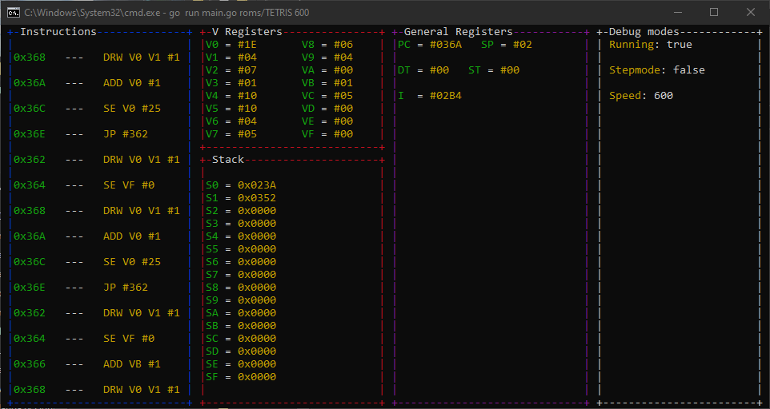

# GoChip8




GoChip8 is a chip8 intepreter written for the purposes of learning Golang and SDL2 to some extent. It implements the [cowgod reference](http://devernay.free.fr/hacks/chip8/C8TECH10.HTM)
version of the opcodes and as such won't work with all roms. However newer games should run fine. It features a pretty nifty little debugger that shows all cpu internals
and allows for step by step code execution. It isn't a perfect emulator, but it was a great learning experience in emulator development and a base for further projects.

# Installing
  * Get SDL2
```
go get -u github.com/veandco/go-sdl2/sdl
```
Installation for SDL2 isn't that simple on windows so check out the installation guide at https://github.com/skatiyar/go-chip8/blob/master/github.com/veandco/go-sdl2

  * Get termui
```
go get -u github.com/gizak/termui/v3
```

  * Get Beep
```
go get -u github.com/faiface/beep
```

  * Get packages
```
go get -u github.com/Kappamalone/GoChip8
```

# Running the emulator

```
go run main.go [path/to/rom] [speed] 
```

Generally a good speed to run most games should be 600-700 cycles per second to ensure smooth gameplay

# Usage

Keybindings are as follows 
```
Chip8 keypad         Keyboard mapping
1 | 2 | 3 | C        1 | 2 | 3 | 4
4 | 5 | 6 | D   =>   Q | W | E | R
7 | 8 | 9 | E   =>   A | S | D | F
A | 0 | B | F        Z | X | C | V

Debugger
P => Toggle pause
I => Toggle stepping mode
O => Step one instruction (if in stepping mode)
[ => decrease emulator speed
] => increase emulator speed
```

# Resources used
I used three main sources to write most of the emulator. 
* http://devernay.free.fr/hacks/chip8/C8TECH10.HTM
* https://tobiasvl.github.io/blog/write-a-chip-8-emulator/
* https://austinmorlan.com/posts/chip8_emulator/

As well as some very helpful advice from the folks over at the r/emudev discord :D
